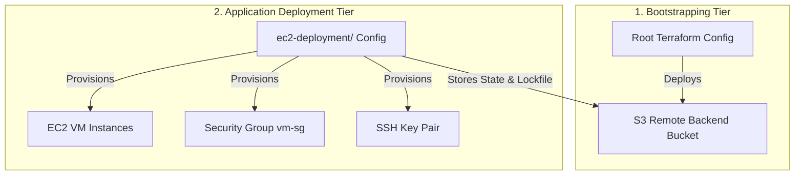

# EC2 Instance & Backend S3 Provisioning Project

This project provides a production-grade, automated infrastructure-as-code solution using **Terraform** and **GitHub Actions** to provision isolated EC2 virtual machine instances behind a secure remote S3 backend.

---

## Project Architecture Overview

The codebase is split into two distinct tiers to follow infrastructure bootstrapping best practices:



### 1. Root Tier (Bootstrap Remote Backend)
* **Location**: Root directory `.`
* **Purpose**: Creates the secure S3 bucket (`mareer-tf-state-prod-001`) used to store remote Terraform state files.
* **Features**:
  * Enforces state versioning to enable rollbacks.
  * Encrypts state files at rest using AES-256 server-side encryption.
  * Configures strict public access blocks and ownership controls to protect sensitive state data.

### 2. Application Deployment Tier (EC2 Infrastructure)
* **Location**: `ec2-deployment/`
* **Purpose**: Configures and deploys the virtual machine instances, secure networking rules, and web server installation.
* **Features**:
  * **OS Detection & User Data**: Auto-detects if the AMI is Windows or Linux and applies corresponding setup script ([userdata.sh](file:///d:/Ec2_instance_task/Ec2_instance_task/ec2-deployment/userdata.sh) installs Apache, [userdata.ps1](file:///d:/Ec2_instance_task/Ec2_instance_task/ec2-deployment/userdata.ps1) sets up IIS).
  * **Private Key Generation**: Generates a high-security RSA private key on-the-fly and saves it locally as a `.pem` file for SSH/RDP access.
  * **Dynamic Naming & Multi-Run Isolation**: Automatically suffixes resource names with a unique `deployment_id` (GitHub Run ID) to prevent collisions across multiple deployments.

---

## Directory Structure

```text
├── .github/workflows/
│   ├── deploy.yml            # CI/CD Workflow: Provision VMs with unique run states
│   └── destroy.yml           # CI/CD Workflow: Manually clean up specific run states
├── ec2-deployment/           # Compute infrastructure folder
│   ├── backend.tf            # Remote S3 backend configuration
│   ├── main.tf               # Infrastructure resources (EC2, Security Groups, Keys)
│   ├── outputs.tf            # Outputs (Instance IDs, Public IP addresses)
│   ├── variables.tf          # Variable declarations (Region, AMI, VM Count, Deployment ID)
│   ├── userdata.sh           # Shell bootstrapper for Ubuntu (installs Apache)
│   └── userdata.ps1          # PowerShell bootstrapper for Windows
├── main.tf                   # Root deployment: Creates remote S3 Bucket
├── variables.tf              # Root variables (bucket name, region)
├── providers.tf              # AWS provider declaration
├── .gitignore                # Ensures sensitive files (.pem, .terraform) are not pushed
└── README.md                 # Project documentation (this file)
```

---

## Deployment Workflows

This project utilizes GitHub Actions workflows to enable continuous delivery and automated resource lifecycle management.

### 1. Deploy EC2 Instances (`deploy.yml`)
Deploys a new set of EC2 instances with unique configuration dynamically.
* **Inputs**:
  * `ami_id` (Required): The AMI ID of the OS to deploy (e.g. `ami-0b6d9d3d33ba97d99` for Ubuntu 24.04 LTS).
  * `vm_count` (Optional): The number of VMs to spin up (default: `1`).
* **Workflow Steps**:
  1. Configures AWS Credentials securely.
  2. Initializes Terraform with a dynamic S3 State Key: `ec2/dev/terraform-${{ github.run_id }}.tfstate`.
  3. Executes `terraform apply` passing variables including `deployment_id=${{ github.run_id }}`.
  4. Outputs the running Instance IDs and Public IPs in the action run summaries.

### 2. Destroy EC2 Instance Run (`destroy.yml`)
Decommissions and tears down resources generated during a specific run to optimize cloud spend.
* **Inputs**:
  * `run_id` (Required): The GitHub Run ID of the deployment you wish to destroy.
* **Workflow Steps**:
  1. Initialises Terraform pointing to the target state file: `ec2/dev/terraform-${{ inputs.run_id }}.tfstate`.
  2. Runs `terraform destroy` with auto-approval to terminate all associated resources (instances, keys, rules) cleanly.

---

## Local Development & Usage

### Prerequisites
* [Terraform v1.10.0+](https://developer.hashicorp.com/terraform/install)
* [AWS CLI](https://aws.amazon.com/cli/) configured with administrative credentials.

### Deploying Locally
If you want to run Terraform commands locally, configure the backend parameters using the CLI:

```bash
# Navigate to deployment directory
cd ec2-deployment

# Initialize with a local/testing run ID
terraform init -backend-config="key=ec2/dev/terraform-local-test.tfstate" -reconfigure

# Plan the infrastructure deployment
terraform plan -var="ami_id=ami-0b6d9d3d33ba97d99" -var="deployment_id=local-test"

# Deploy the resources
terraform apply -var="ami_id=ami-0b6d9d3d33ba97d99" -var="deployment_id=local-test" -auto-approve
```

### Destroying Locally
```bash
terraform destroy -var="deployment_id=local-test" -auto-approve
```
